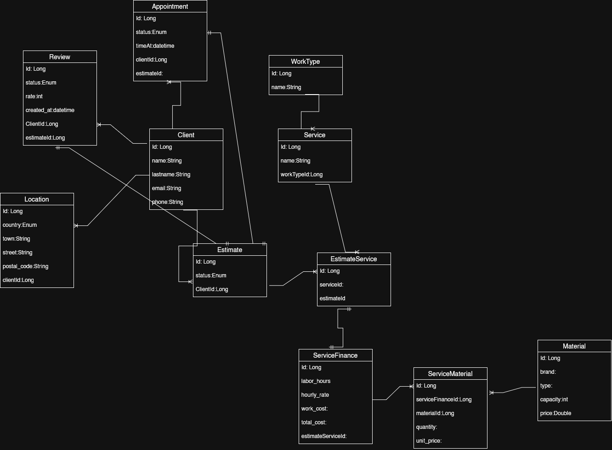

# YourLocalService-Backend


## Overview

This backend is the centralized service layer for the "Your Local Service" platform. It provides a robust, scalable foundation for managing client relationships, location data, and communication flows.

Designed with modularity in mind, the system decouples core business logic (Clients, Locations) from utility services (Email), allowing for independent scaling and maintenance. While currently serving as a monolithic API for the frontend, the architecture is structured to support future microservice extraction if required.

## Problem Statement

Many service-based applications struggle with tightly coupled logic where notification systems, user management, and operational data are intertwined. This project solves that by:

1.  **Centralizing Communication**: A dedicated Email Service handles all outbound notifications, abstracting SMTP complexity from other modules.
2.  **Standardizing Domain Data**: Providing a consistent schema for Clients and Locations that can be reused across different service contexts (Estimates, Appointments).
3.  **Future-Proofing**: Preparing the ground for complex workflows (Invoicing, Reviews) through a well-defined Entity-Relationship model.

## Architecture

The system follows a standard Layered Architecture to ensure separation of concerns:

- **Controller Layer**: Handles HTTP requests and response formatting.
- **Service Layer**: Contains business logic and transaction management (`@Transactional`).
- **Repository Layer**: Manages data persistence using Spring Data JPA.
- **Domain Layer**: Defines pure Entities and DTOs to separate database schema from API contracts.

### Entity-Relationship Diagram (ERD)

The following diagram illustrates the target architecture, including implemented modules (Client, Location) and planned extensions (Appointments, Estimates).



## Key Features

### 1. Communication Service (Live)

- **Email API**: A production-ready endpoint for handling contact forms and system notifications.
- **SMTP Integration**: Configurable integration with Gmail SMTP (or any standard provider).
- **Asynchronous Processing**: (Planned) ready for queue-based email dispatch.

### 2. Core Domain (Foundation)

- **Client Management**: Logic for creating and updating client profiles.
- **Location Services**: Handling address and geographic data with strict typing (Enums for Countries).
- **Data Integrity**: Transactional updates ensure Client and Location data remain consistent.

## Tech Stack & Rationale

- **Java 17**: LTS version providing modern language features (Records, Pattern Matching) and performance stability.
- **Spring Boot**: Chosen for its "convention over configuration" approach, robust dependency injection, and massive ecosystem support.
- **PostgreSQL**: A powerful, open-source relational database selected for its reliability and support for complex queries (JSONB, spatial extensions if needed).
- **Spring Data JPA**: Simplifies data access and significantly reduces boilerplate code for CRUD operations.
- **Spring Security**: Provides a secure foundation. Currently configured for development (CORS enabled), ready to scale to OAuth2/JWT.

## Getting Started

### Prerequisites

- Java 17 JDK
- Maven 3.8+
- PostgreSQL

### Configuration

The application relies on environment variables for sensitive credentials. Create a `.env` file or export the following variables:

| Variable       | Description               | Example                                    |
| :------------- | :------------------------ | :----------------------------------------- |
| `DB_URL`       | PostgreSQL Connection URL | `jdbc:postgresql://localhost:5432/your_db` |
| `DB_USER`      | Database Username         | `postgres`                                 |
| `DB_PASS`      | Database Password         | `secret`                                   |
| `EMAIL_SENDER` | SMTP Account Email        | `no-reply@example.com`                     |
| `SMTP_PASS`    | SMTP App Password         | `abcd 1234 efgh 5678`                      |
| `SMTP_PORT`    | SMTP Port                 | `587`                                      |
| `CORS_ALLOWED` | Allowed Origin for CORS   | `http://localhost:3000`                    |

### Running Locally

1.  **Clone the repository:**

    ```bash
    git clone https://github.com/NikitaaOvramenko/yourlocalservice-spingboot-backend.git
    cd yourlocalservice-spingboot-backend
    ```

2.  **Build the project:**

    ```bash
    ./mvnw clean install
    ```

3.  **Run the application:**
    ```bash
    ./mvnw spring-boot:run
    ```

The server will start on port `8080`.

## API Documentation

### Email Service

**Endpoint:** `POST /api/email/form`

Sends a form submission email to the client/admin.

**Request Body:**

```json
{
  "name": "John",
  "lastname": "Doe",
  "email": "john.doe@example.com",
  "phone": "+1234567890",
  "workType": "Plumbing",
  "service": "Leak Fix",
  "country": "USA",
  "town": "New York",
  "street": "5th Avenue",
  "postal_code": "10001",
  "description": "Urgent leak in the basement."
}
```

**Response:** `200 OK` with the processed Email DTO.

## Future Improvements

Based on the architectural roadmap:

1.  **Appointment Scheduling**: Implement the `Appointment` entity and logic to link Clients with Services.
2.  **Estimation System**: Build the `Estimate` and `ServiceFinance` modules to calculate costs based on materials and labor.
3.  **Security Hardening**: Move from basic CORS configuration to a full JWT-based authentication flow.
4.  **API Documentation**: Integrate Swagger UI for auto-generated API docs.
